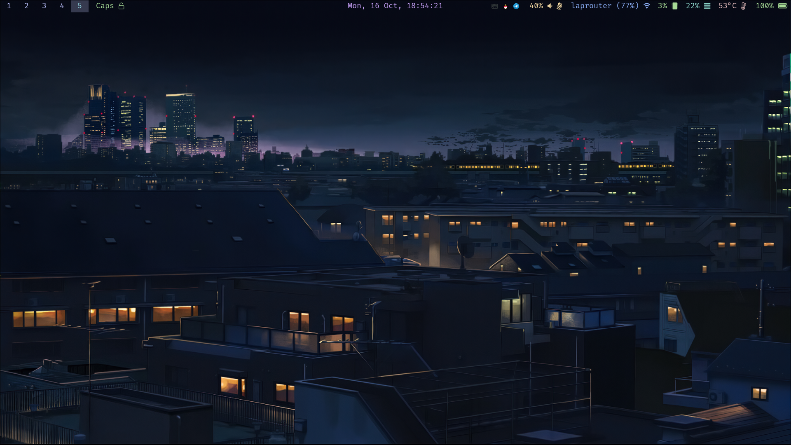

# dotfiles

> My awful dotfiles :)  
> Still working in progress 🚧  

### 📦 Dependencies  
- **Application Launcher**: [Tofi]  
- **Audio Control**: [Pamixer]  
- **DE**: [Hyprland]  
- **Editor**: [Neovim]  
- **Fetch**: [Neofetch]  
- **Font**: FiraCode Nerd Font, SymbolOnly Nerd Font, Joypixels Font  
- **IME**: [Fcitx5]
- **Screenshot**: [Grim] with [Slurp]  
- **Shell**: Bash  
- **Shell Prompt**: [Starship]  
- **Status Bar**: [Waybar]  
- **Terminal**: [Kitty]  
- **Theme**: [Catppuccin-macchiato]
- **Wallpapers**: [Swww]  

These are mainly dependencies i remembered in repo.

### 📷 ScreenShot  
You can get this wallpaper from [here](https://www.reddit.com/r/anime/comments/cb8ce4/you_guys_asked_for_wallpapers_from_5_centimeters/). Different sizes of wallpaper can be downloaded.  

  

[Hyprland]: https://hyprland.org  
[Waybar]: https://github.com/Alexays/Waybar  
[Neofetch]: https://github.com/dylanaraps/neofetch  
[Kitty]: https://sw.kovidgoyal.net/kitty
[Tofi]: https://github.com/philj56/tofi  
[Neovim]: https://neovim.io  
[Pamixer]: https://github.com/cdemoulins/pamixer  
[Starship]: https://starship.rs  
[Grim]: https://sr.ht/~emersion/grim  
[Slurp]: https://github.com/emersion/slurp  
[Swww]: https://github.com/Horus645/swww
[Catppuccin-macchiato]: https://github.com/catppuccin/catppuccin  
[Fcitx5]: https://github.com/fcitx/fcitx5
